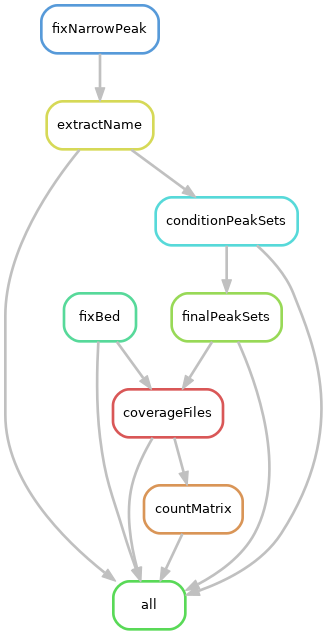

# Furey-Lab-ATAC-seq
Adaptation of the PEPATAC pipeline for use on UNCs Longleaf with additional post-processing steps.

## Summary

Assuming you have your config and annotation file set up, all you'll need to do is go to the directory **in scratch space** that you want to work in, and execute the following commands:

```
git clone https://sc.unc.edu/dept-fureylab/atac_pepatac.git
cd atac_pepatac
source PEPATACenv.sh human
looper run /path/to/PEPATAC_config.yaml
```

If working with mouse samples, the _"source PEPATACenv.sh human"_ is replaced with _"source PEPATACenv.sh mouse"_

## Set up

#### Cloning the pipeline files and setting up your environment

Setting up the pipelines itself _should_ be easy, requiring a clone of the ATAC_pepatac repo from the lab git and a single command to load module and environmental variables. The pipeline is currently only set up for **hg38** and **mm10**.

The pipeline will need to run from a suitable directory in your scratch space. the path to your scratch space is relative to your UNC onyen, e.g. /pine/scr/O/N/ONYEN. Once there, create a directory that you can run the analysis out of. For example:

```
cd /pine/scr/b/p/bpk
mkdir 2020_06_19_analysis
cd 2020_06_19_analysis
```

You're now set to grab the files you need. To clone the files you'll need, use the command:

```
git clone https://sc.unc.edu/dept-fureylab/atac_pepatac.git
mv atac_pepatac/* .
rm -rf atac_pepatac
```

Various software and environmental pointers are needed to run PEPATAC. To set all of this up, you will need to source the _PEPATACenv.sh_ file as follows:

```
source PEPATACenv.sh human
```

or for mouse samples:

```
source PEPATACenv.sh mouse
```

Although the pipeline (at time of writing: June 19th 2020) is only set up for mm10 and hg38, these commands will not need to change. Rather the /proj/fureylab/genomes/human/refgenie/ and /proj/fureylab/genomes/mouse/refgenie/ directories will just need to updated with the needed genome builds which can then be added to the PEPATAC config file, which we'll get to next.

#### Config and annotation files

PEPATAC uses the PEP 2.0 standard for configuration files, which is a way of standardizing pointers to various things and options you may want to set when running a pipeline. The files _PEPATAC_config.yaml_ and _PEPATAC_annotation.csv_, which are now in your analysis directory after cloning the atac repo, will serve as templates which you can use to set up your run of the pipeline.

Setting these files up is easy!

<ins>**Annotation file**<ins/> - PEPATAC_annotation.csv


Populate your annotation file with the samples you want to run through the pipeline. The format is one sample per row. The only potential pitfall here may be the _read1_ and _read2_ columns. These are just variable names that will be used in the config file to point to where the pipeline can fine you forward and reverse read files. To keep things easy, just call these "sampleName_R1" and "sampleName_R2".


<ins>**Config file**<ins/> - PEPATAC_config.yaml

The config file contain a number of fields that you will need to edit, and a few that should not be changed. The fields that you should not change (pipeline_interfaces) are marked with the comments "_# DO NOT CHANGE!_".

Fields to edit:

- name - This is used in summary files. Give your project a useful name and a date that you can easily reference. **Do not include any spaces in this project name**, use underscores instead.
- sample_table - This will only need to be changed if you have edited the name of your annotation files
- output_dir - This is probably the directory you are currently in (or where you clone to pipeline files to). Use the command "pwd" to get the path of the directory you are in.
- sources - Like I mentioned in the annotation file section, those read1 and read2 columns now come into place. For paired end data, you'll need two entries per sample, with each entry pointing to the full path of the forward or reverse gzipped fastq file.

## Running the pipeline

Once everything is in place, running the pipeline is really easy. You will only need one command:

```
looper run PEPATAC_config.yaml
```

This should project a commands and tell you how many samples were submitted to the cluster. To check whether jobs are running and the status of jobs, use the command:

```
looper check PEPATAC_config.yaml
```

or to see how jobs are running on SLURM directly:

```
squeue -u ONYEN
```

## QC and moving files

##### Checking and resubmitting

As a reminder, to use any looper commands you need all the module and environmental variables loaded. If you have logged out of longleaf since running or submitting looper commands, make sure to rerun the "source" command for _PEPATACenv.sh_.

Once all jobs have finished, check to see whether all jobs have finished using:

```
looper check PEPATAC_config.yaml
```

You should see 0 failed jobs. In the event that you do see failed jobs, you can use the command:

```
looper rerun PEPATAC_config.yaml
```

to resubmit those jobs that failed. **You will not have to delete any files and the pipeline will not resubmit any samples that finished successfully**.

##### Producing QC stats tables and html outputs

To create a QC metadata table along with html outputs summarizing QC across samples in the run, you will need to use the command:

```
looper report PETATAC_config.yaml
```

There will be a number of files that cannot be generated during this step, meaning that you'll get the message _Not found_ at the end of running this command. **This is normal** and is due to the R script used during section not being fully completed.

One of the files that is output from this step, _"[analysisName]stats_summary.tsv"_ is used by the script that handles the copying of files to permanent space. This same file also provides all the QC metrics you will need for downstream processing.

##### Copying files to permanent space

To move your files from scratch space to the data directory, you can use the script _pepatacPostMove.py_, which is located in the labs' bin directory. The script takes 3/4 arguments:

- The stats.summary.tsv files generated from the "looper report" step
- A column that points to where the fastq files are located (This will almost always be 'read1')
- The genome build used in this run
- the flag '--run' when you're ready to initiate copying

Before we potentially copy over TBs of data, lets make sure the copy commands look right by **not** including the '--run' flag.

```
module load python/3.6.6
python /proj/fureylab/bin/pepatacPostMove.py -i [analysisName]stats_summary.tsv -r read1 -g hg38
```

This will print the commands that would be executed if the '--run' flag was added. When everything looks good, add '--run':

```
python /proj/fureylab/bin/pepatacPostMove.py -i [analysisName]stats_summary.tsv -r read1 -g hg38 --run
```

If you need more information about how to format the command or the inputs you need, you can use the command:

```
python /proj/fureylab/bin/pepatacPostMove.py -h
```

**NOTE:** When processing 10+ samples through this command, submit this command through SLURM as it may take a little while to run. This could be formatted like the below command:

```
module load python/3.6.6
sbatch -o sampleMove.out -t 1-0 --wrap="/proj/fureylab/bin/pepatacPostMove.py \
-i [analysisName]stats_summary.tsv -r read1 -g hg38 --run"
```

## Post-processing pipeline

The aim of the post-processing pipeline is to provide condition-specific peak sets (i.e. CD peaks, treated peaks, control peaks etc..) and various count matrices that can be used in your downstream analysis. This is a snakemake pipeline and can be run either immediately after running PEPATAC, or on files that have already been processed and are stored somewhere in the data directory. Like our RNA pipeline, the pipeline can be rerun when completed to save the important output files.

##### Overview



As a brief overview of the pipeline:

- **"Fix steps"** - These steps are to remove unmapped contigs and to remove peaks that extend over the end of a chromosome (resulting in negative coordinates). If retained, these cause a bunch of issues for steps further in this pipeline and further in the downstream analysis, so it's just easier to remove them.
- **ExtractName** - Placing the sample name in the 4th column of peak bed files. This is used for counting shared peaks between samples in the next step.
- **ConditionPeakSets** - The aim here is to create peak sets based on the conditions specified in the configuration file. All peak files across a condition are merged together and peaks are assigned a value according to the number of samples a peak was called in. Peaks are retained for the final condition peak set if a peak is seen across a specified threshold of samples (discussed further in the configuration file setup).
- **finalPeakSets** - Peak sets across conditions are merged and the final peak set is further divided into promoter and distal files through an R script using the ChIPSeeker package. For compatibility with additional genomes (hg19, hg38, mm9, mm10 supported at the time of writing), this is the part of the pipeline that needs to be modified. Specifically, TxDb files will need to be generated for the genome of intertest, and an annotation package will need loaded ("org.X.eg.db"). For more information on generation TxDB files, see scripts accompanying the generated TxDbs in the genomes directory (e.g. "/proj/fureylab/genomes/human/hg38_reference/txdb/makeTxDb_hg38.r"). Lastly, for each of these final peak files (final peaks, final promoter peaks, final distal peaks), 300bp windows are generated.
- **coverageFiles** - Using the previously generated peak files, this rule submits a bunch of jobs to SLURM to generate a sample-specific coverage matrix of the number of reads overlapping peaks and 300bp windows.
- **countMatrix** - This final rule submits jobs to SLURM that generate final count matrices. **The snakemake pipeline will terminate when these jobs are submitted to the cluster, but the pipeline will not be finished until these files have finished running**. The previous coverage matrix generation step is quite memory intensive, so you may be in the queue of the bigmem partition for a little while if you're trying to run the post-processing pipeline with a large number of samples (~25+).  

Once the pipeline has been run through, you can rerun the pipeline after setting the "moveOut" in the configuration file to "TRUE" to copy files to permanent space. This is discussed further in the next section.  

##### Setup

As a reminder if you're _just_ running the post-processing pipeline, you will need to run this in your scratch space and clone the files you'll need using the clone commands specified above. If you've already run PEPATAC, you will have all the files you need. The setup of modules and environmental variables is the same as when running the PEPATAC pipeline, **so make sure that the "PEPATAVenv" is sourced before running the post-processing pipeline**.

Before running the pipeline, you will need to set up the configuration file _"postProcessing_config.yaml"_. The file itself is really simple and only contains a few flags and sections.

- **ProjectName** - This should be set to the same as "name" in the PEPATAC_config.yaml file. If you didn't run PEPATAC previously, use a useful name and a date that you can easily reference. **Do not include any spaces in this project name**, use underscores instead.
- **genomeBuild** - Can be set to hg19, hg38, mm9, or mm10.
- **sampleCutoff** - This value is a proportion that is used to determine whether a peak is retained for the condition-specific peak sets. In a scenario where there are 4 disease/4 control samples, a sampleCutoff of 0.5 means that a peak must be found in **at least** 2 samples. In a scenario where there are 4 disease/8 control, a sampleCutoff of 0.5 means that a peak must be found in at least 2 samples **in both conditions**. The pipeline will always use the condition with the fewest samples to determine cutoff and will use this threshold across all conditions.
- **moveOut** - Set to TRUE after the pipeline is completed to move outputs to the directory specified by the "projectDir" flag
- **projectDir** - Directory that output files will be moved to. By default this is set to the top level directory where these files should be moved to. If you know specifically where these outputs below, feel free to change this path. Note that the directory that you're point to should already exist.
- **post-PEPATAC** - Set this to true if you're running immediately after running PEPATAC. If TRUE, the post-processing pipeline will look in results_pipeline for the files it needs.

<ins>Samples and conditions<ins/>

The configuration file contains examples of how these flags should be set up. When post-PEPATAC is set to TRUE, the samples field just needs to contain sample numbers that were used in the PEPATAC pipeline. These should be same as the sample identifiers used in the PEPATAC_annotation file.

```
samples:
  - 185
  - 187
  - 206
  - 208
```

When running the post-processing pipeline independent of PEPATAC, the samples field will need to contains paths to the samples of interest.

```
samples:
  - /proj/fureylab/data/ATAC/human/colon_tissue/CD_uninflamed/185
  - /proj/fureylab/data/ATAC/human/colon_tissue/CD_uninflamed/187
  - /proj/fureylab/data/ATAC/human/colon_tissue/nonIBD/206
  - /proj/fureylab/data/ATAC/human/colon_tissue/nonIBD/208
```

The order of the conditions must match the order of the samples and condition strings cannot contain any whitespace characters. As a simple example to match the above samples:

```
conditions:
  - CD
  - CD
  - NIBD
  - NIBD
```

The format of this field is will be the same whether post-PEPATAC is set to TRUE or FALSE.

##### Running the pipeline

Once the config file is set up and the PEPATACenv file has been sourced, you are ready to run the pipeline. Regardless of how the configuration file has been set up, submission will always be the same command:

```
snakemake --printshellcmds --jobs=100 --cluster-config cluster_config.json \
--cluster "sbatch --mem={cluster.mem} -t {cluster.time} -n {cluster.ntasks} \
-o {cluster.output} -e {cluster.err} -J {cluster.jobname}"

```

If you want to make sure that everything is set up correctly before running the pipeline, you can do a dry run by adding the flag _"-n"_. You will get a print out of the jobs that would have been submitted if everything has been set up correctly.

The outputs are written to a directory called "post-processing", itself contain four directories:

- countMatrices - Contain 6 count files. all, promoter, distal for peak level counts, and all, promoter, distal for 300bp window level counts.
- logs - logs files from various steps of the pipeline. Useful for debugging and for future reference
- peakFiles - Condition-specific, final peak files, promoter/distal peaks, and 300bp windows files
- temp - Intermediate files generated throughout the pipeline. These files are not copied across when setting "moveOut" to TRUE.
